# Architecture Diagram — Library Assistant

## 4-Layer Architecture

```mermaid
graph TB
    subgraph FRONTEND["🖥️  LAYER 1 — Frontend (Static HTML/JS)"]
        direction LR
        LOGIN["login.html\n• Sign in / Sign up\n• Stores JWT in localStorage"]
        CHAT["chat.html\n• Session sidebar\n• Streaming chat UI\n• RAG metrics panel\n• Chunking controls"]
    end

    subgraph API["⚡  LAYER 2 — API Layer (FastAPI Routers)"]
        direction LR
        R_AUTH["auth.py\nPOST /auth/signup\nPOST /auth/login\nPOST /auth/token"]
        R_USER["user.py\nGET /users/{id}"]
        R_CHAT["chat.py\nPOST /chat (legacy)\nCRUD /chat/sessions\nPOST /sessions/{id}/messages\nPOST /sessions/{id}/stream"]
        R_EVAL["eval.py\nPOST /eval/reindex\nPOST /eval/upload-pdf\nPOST /eval/run\nGET  /eval/settings"]
        R_WS["websocket.py\nWS /ws/chat"]
    end

    subgraph AGENT["🤖  LAYER 3 — Agent & Service Layer"]
        direction TB

        subgraph AGENTS["Agent Sub-layer"]
            ORCH["orchestrator.py\nRoutes user intent to\nCatalog Agent or Policy Agent"]
            CAT_A["catalog_agent.py\nBook search, borrow,\nreturn, loan history"]
            POL_A["policy_agent.py\nLibrary hours, fines,\nmembership, rules"]
        end

        subgraph SERVICES["Service Sub-layer"]
            LIB_T["library_tools.py\nsearch_books()\nborrow_book()\nreturn_book()\nget_my_borrowed_books()"]
            QDRANT_S["qdrant_service.py\nembed_text() → Gemini\nsearch_library() + Redis cache\nupsert_documents()"]
            CACHE_S["cache.py\nIn-process Python dict\nTTL-based reply cache\n(legacy, pre-Redis)"]
            CHUNK_S["chunking.py\nfixed_size_chunking()\nsemantic_chunking()\nbatch_embed_texts()"]
            EVAL_S["retrieval_eval.py\nrun_eval_harness_logic()\nevaluate_rag_metrics()"]
            MOD_S["moderation.py\nis_blocked() guardrail"]
            PDF_S["pdf_service.py\nextract_text_from_pdf_bytes()"]
            CORPUS["corpus.py\nRAW_DOCUMENTS (26 docs)\nEVAL_QUESTIONS\nadd_documents_to_corpus()"]
        end

        ORCH --> CAT_A
        ORCH --> POL_A
        CAT_A --> LIB_T
        POL_A --> QDRANT_S
    end

    subgraph DATA["🗄️  LAYER 4 — Data Layer"]
        direction LR
        PG[("PostgreSQL\nusers\nchat_sessions\nchat_messages\nbooks\nloans")]
        QDRANT[("Qdrant\nVector DB\nlibrary_knowledge\ncollection")]
        REDIS[("Redis\nExact-match cache\nkey: rag:kb:{sha256}\nTTL: 1 hour")]
        GEMINI_API["Gemini API\ngemini-embedding-001\n768-dim vectors"]
        CEREBRAS_API["Cerebras API\nllama3.1-8b\nLLM inference"]
        LANGFUSE["Langfuse\nObservability &\nLLM tracing"]
    end

    %% Frontend → API
    LOGIN -->|"HTTP POST /auth/login"| R_AUTH
    CHAT -->|"HTTP REST + SSE stream"| R_CHAT
    CHAT -->|"WebSocket"| R_WS
    CHAT -->|"HTTP POST /eval/reindex"| R_EVAL

    %% API → Service/Agent
    R_CHAT -->|"orchestrate()"| ORCH
    R_CHAT -->|"is_blocked()"| MOD_S
    R_CHAT -->|"get_cached_reply()"| CACHE_S
    R_CHAT -->|"search_library()"| QDRANT_S
    R_EVAL -->|"run_eval_harness_logic()"| EVAL_S
    R_EVAL -->|"fixed/semantic_chunking()"| CHUNK_S
    R_EVAL -->|"extract_text_from_pdf_bytes()"| PDF_S
    R_EVAL -->|"add_documents_to_corpus()"| CORPUS
    R_WS -->|"run_orchestrator()"| ORCH

    %% Service → Data
    LIB_T -->|"SQLAlchemy ORM"| PG
    QDRANT_S -->|"qdrant-client"| QDRANT
    QDRANT_S -->|"redis-py GET/SET"| REDIS
    QDRANT_S -->|"HTTPS embed"| GEMINI_API
    CHUNK_S -->|"HTTPS embed"| GEMINI_API
    ORCH -->|"HTTPS chat"| CEREBRAS_API
    CAT_A -->|"HTTPS chat"| CEREBRAS_API
    POL_A -->|"HTTPS chat"| CEREBRAS_API
    ORCH -.->|"@observe trace"| LANGFUSE
    CAT_A -.->|"@observe trace"| LANGFUSE
    POL_A -.->|"@observe trace"| LANGFUSE

    %% Auth path
    R_AUTH -->|"SQLAlchemy ORM"| PG
    R_USER -->|"SQLAlchemy ORM"| PG

    %% Styling
    classDef frontendStyle fill:#1a1a2e,stroke:#e94560,color:#fff
    classDef apiStyle fill:#16213e,stroke:#0f3460,color:#fff
    classDef agentStyle fill:#0f3460,stroke:#533483,color:#fff
    classDef dataStyle fill:#533483,stroke:#e94560,color:#fff

    class LOGIN,CHAT frontendStyle
    class R_AUTH,R_USER,R_CHAT,R_EVAL,R_WS apiStyle
    class ORCH,CAT_A,POL_A,LIB_T,QDRANT_S,CACHE_S,CHUNK_S,EVAL_S,MOD_S,PDF_S,CORPUS agentStyle
    class PG,QDRANT,REDIS,GEMINI_API,CEREBRAS_API,LANGFUSE dataStyle
```



---

## Key Request Flows

### Flow A — User sends a chat message (streaming)

```
chat.html  →  POST /chat/sessions/{id}/stream  →  orchestrator.py
           →  [catalog_agent OR policy_agent]
           →  [library_tools.py → PostgreSQL]  (catalog path)
           →  [qdrant_service.py → Redis → Qdrant → Gemini embed]  (policy path)
           →  Cerebras LLM
           →  SSE stream back to browser
```

### Flow B — User asks a policy question (cache hit)

```
chat.html  →  POST /chat/sessions/{id}/stream  →  orchestrator.py
           →  policy_agent.py  →  search_knowledge_base tool
           →  qdrant_service.search_library()
           →  Redis.get(sha256_key)  ← HIT: return in ~1ms, skip Qdrant + Gemini
           →  Cerebras LLM with cached context
           →  SSE stream back to browser
```

### Flow C — Admin reindexes the knowledge base

```
chat.html  →  POST /eval/reindex  →  eval.py router
           →  chunking.py (fixed or semantic)
           →  gemini embed  →  qdrant_service  →  Qdrant upsert
```

---

## Boundary Violations (cross-references to boundary_violations.md)

| Boundary | Where violated |
|----------|----------------|
| API → Data (skipping service layer) | auth.py V1, user.py V2, chat.py V3, V4, websocket.py V9 |
| API → External API (skipping agent) | chat.py /chat legacy endpoint V6 |
| API → Qdrant (skipping qdrant_service) | eval.py /reindex V7 |
| Dead code (wasted Data Layer call) | chat.py stream_message outer RAG block V5 |
