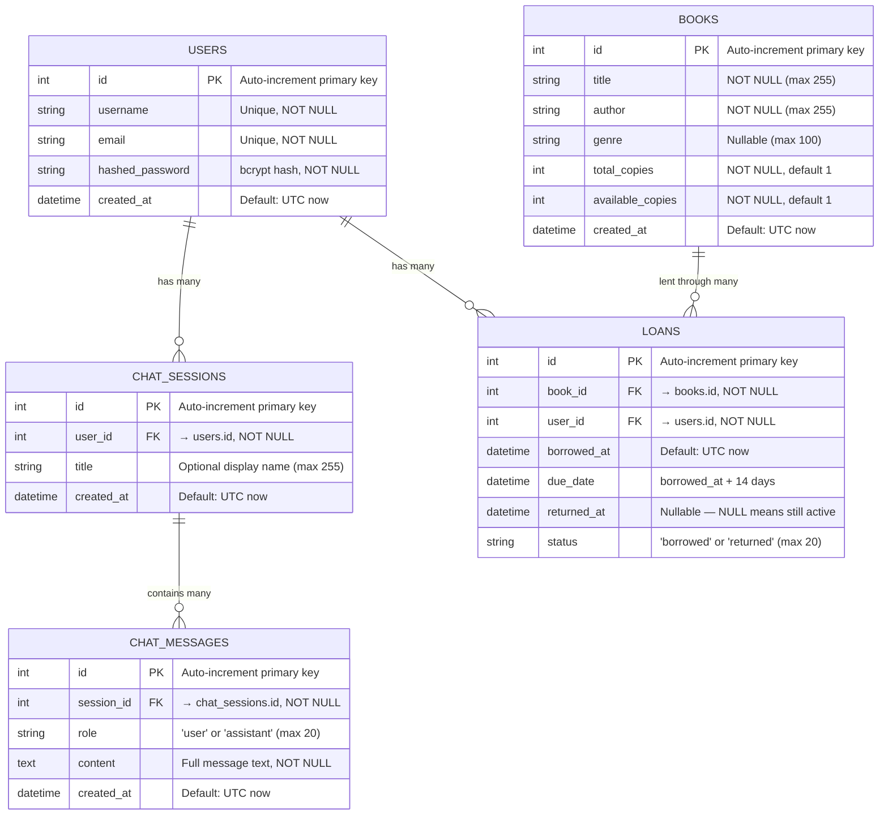

# Database ERD — Library Assistant

## Entity Relationship Diagram (PostgreSQL)

---

## Table Descriptions

### `users`
The central identity table. Every other authenticated operation traces back to a `user.id`.
One user can have many chat sessions and many active loans simultaneously.

| Column | Type | Notes |
|--------|------|-------|
| `id` | INTEGER | Auto PK |
| `username` | VARCHAR | Unique across all users |
| `email` | VARCHAR | Unique, used as alternate login |
| `hashed_password` | VARCHAR | bcrypt (never stored plain) |
| `created_at` | TIMESTAMP | UTC, set on insert |

---

### `chat_sessions`
Groups messages into conversations. Each session belongs to exactly one user.
Cascade-delete: deleting a user deletes all their sessions and messages.

| Column | Type | Notes |
|--------|------|-------|
| `id` | INTEGER | Auto PK |
| `user_id` | INTEGER | FK → `users.id` |
| `title` | VARCHAR(255) | Optional label shown in sidebar |
| `created_at` | TIMESTAMP | UTC |

---

### `chat_messages`
Individual turns in a conversation. `role` is always `"user"` or `"assistant"`.
Messages are ordered by `created_at ASC, id ASC` to reconstruct history.
Cascade-delete: deleting a session deletes all its messages.

| Column | Type | Notes |
|--------|------|-------|
| `id` | INTEGER | Auto PK |
| `session_id` | INTEGER | FK → `chat_sessions.id` |
| `role` | VARCHAR(20) | `"user"` or `"assistant"` |
| `content` | TEXT | Full message text |
| `created_at` | TIMESTAMP | UTC |

---

### `books`
The library catalog. `available_copies` is decremented on borrow and incremented on
return — it must always satisfy `0 ≤ available_copies ≤ total_copies`.
This invariant is enforced in `library_tools.borrow_book()`, not by a DB constraint.

| Column | Type | Notes |
|--------|------|-------|
| `id` | INTEGER | Auto PK |
| `title` | VARCHAR(255) | NOT NULL |
| `author` | VARCHAR(255) | NOT NULL |
| `genre` | VARCHAR(100) | Nullable |
| `total_copies` | INTEGER | Total physical copies |
| `available_copies` | INTEGER | Currently available for loan |
| `created_at` | TIMESTAMP | UTC |

---

### `loans`
A loan record is created on borrow and updated (not deleted) on return.
`status` transitions: `"borrowed"` → `"returned"`.
`returned_at` is NULL while the book is still out.

| Column | Type | Notes |
|--------|------|-------|
| `id` | INTEGER | Auto PK |
| `book_id` | INTEGER | FK → `books.id` |
| `user_id` | INTEGER | FK → `users.id` |
| `borrowed_at` | TIMESTAMP | UTC, set on insert |
| `due_date` | TIMESTAMP | `borrowed_at + 14 days` (set in code) |
| `returned_at` | TIMESTAMP | NULL = still borrowed |
| `status` | VARCHAR(20) | `"borrowed"` or `"returned"` |

---

## Relationships

| Relationship | Type | Cascade |
|-------------|------|---------|
| `users` → `chat_sessions` | One-to-Many | delete-orphan |
| `chat_sessions` → `chat_messages` | One-to-Many | delete-orphan |
| `books` → `loans` | One-to-Many | none (loans kept for history) |
| `users` → `loans` | One-to-Many | none (no ORM back-ref defined — see note) |

> **Note:** `loans.user_id` references `users.id` at the DB level, but the `User` ORM
> model does **not** define a `loans` back-reference. This means you cannot do
> `user.loans` in Python — you must query `Loan` directly. This is a minor ORM gap;
> adding `loans = relationship("Loan", ...)` to the `User` model would clean it up.

---

## What is NOT in Postgres (stored elsewhere)

| Data | Where stored | Why |
|------|-------------|-----|
| Library policy text (26 docs) | `corpus.py` in-memory list | Static reference data, no user mutation needed |
| Document vectors (embeddings) | Qdrant cloud collection | Optimised for cosine-similarity search |
| Search result cache | Redis (key-value, TTL 1h) | Ephemeral, high-speed, auto-expiring |
| Conversation history for WS | In-memory list (per connection) | WebSocket sessions are transient |
| Chunking strategy settings | In-memory module variable | Resets on restart — intentional for eval |
